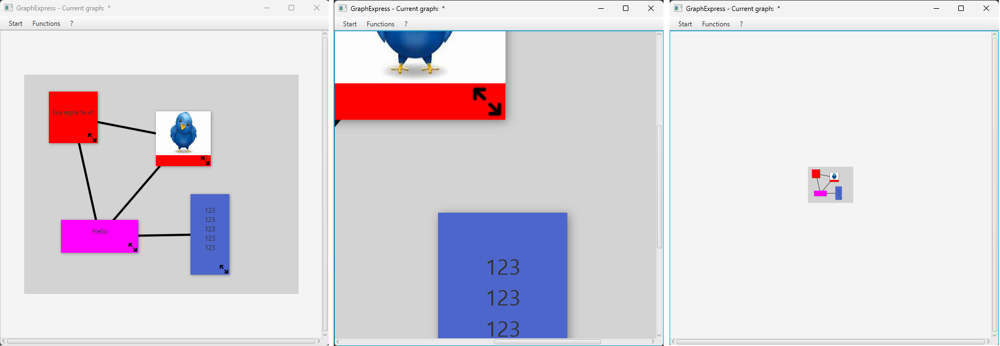
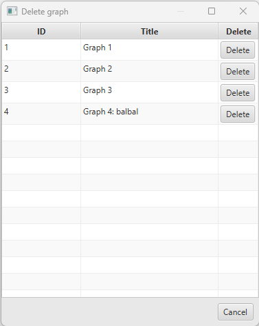
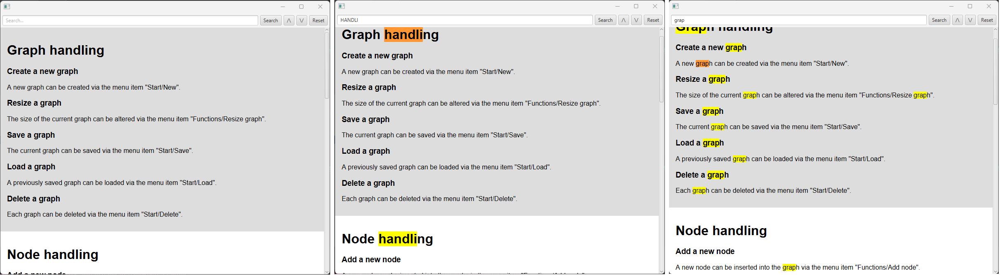
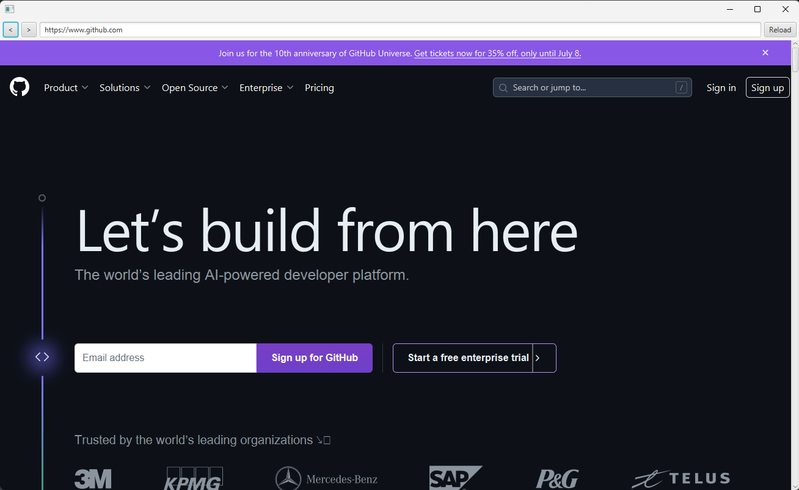

### Description

A library which provides custom JavaFX nodes, enhancing your UI with advanced features and seamless functionality for a
superior user experience.

### Features

| Class name         | Description                                                                                         |
|--------------------|-----------------------------------------------------------------------------------------------------|
| ZoomableScrollPane | A versatile ScrollPane that provides seamless zooming capabilities for enhanced content navigation. |
| ButtonTableCell    | A specialized node that integrates a button within table cells, complete with customizable actions. |
| HtmlViewer         | An advanced HTML viewer that renders content from a URI and supports text search and highlighting.  |
| WebBrowser         | A streamlined web browser component featuring a URL bar and essential navigation tools.             |

### Requirements

| Technology | Version |
|------------|---------|
| Java       | 17      |
| JavaFX     | 17.0.8  |

### Dependencies to add

##### Maven

    <!-- Maven looks in the central repository by default. -->
    <dependency>
      <groupId>com.wedasoft</groupId>
      <artifactId>wedasoftfxcustomnodes</artifactId>
      <version>1.1.0</version>
    </dependency>

##### Gradle

    repositories {
      mavenCentral()
    }
    dependencies {
      implementation("com.wedasoft:wedasoftfxcustomnodes:1.1.0")
    }

### Documentation

##### ZoomableScrollPane

Usage example:

    @FXML
    private BorderPane borderPane;
    
    private YourNodeInZoomPane yourNode; // Can be any node. BorderPane, Node, VBox, etc, ...

    borderPane.setCenter(new ZoomableScrollPane(yourNode));

##### ButtonTableCell

You can put <code>Buttons</code> in any column and set their actions.

Usage example:

    @RequiredArgsConstructor
    @Getter
    public class DeleteGraphViewTableRow {
        private final long graphId;
        private final String graphTitle;
    }

    public class DeleteGraphViewController {
    
        @FXML
        private TableView<DeleteGraphViewTableRow> tableView;
        @FXML
        private TableColumn<DeleteGraphViewTableRow, Long> idColumn;
        @FXML
        private TableColumn<DeleteGraphViewTableRow, String> titleColumn;
        @FXML
        private TableColumn<DeleteGraphViewTableRow, Void> deleteButtonColumn;
    
        public void initialize() {
            ...
            idColumn.setCellValueFactory(c -> new SimpleLongProperty(c.getValue().getGraphId()).asObject());
            titleColumn.setCellValueFactory(c -> new SimpleStringProperty(c.getValue().getGraphTitle()));
            deleteButtonColumn.setCellFactory(c -> new ButtonTableCell<>("Delete", this::onDeleteButtonClick));
            ...
        }

        public void onDeleteButtonClick(DeleteGraphViewTableRow tableRow) {
            graphPaneService.deleteGraphPaneById(tableRow.getGraphId());
            tableView.getItems().remove(tableRow);
        }
    
    }

##### HtmlViewer

You can embed the <code>HtmlViewer</code> in any <code>Node</code> or <code>Scene</code>.

Usage example:

    HtmlViewer htmlViewer = new HtmlViewer(getClass().getResource("/com/wedasoft/wedasoftFxCustomNodes/testHtmlFile.html"));
    stage = new Stage();
    stage.setScene(new Scene(htmlViewer));
    stage.show();

##### WebBrowser

You can embed the <code>WebBrowser</code> in any <code>Node</code> or <code>Scene</code>.

Usage example:

    @FXML
    private BorderPane borderPane;

    WebBrowser webBrowser = new WebBrowser();
    webBrowser.loadUrl(currentWebBrowser.getCurrentUrl());
    borderPane.setCenter(webBrowser);

